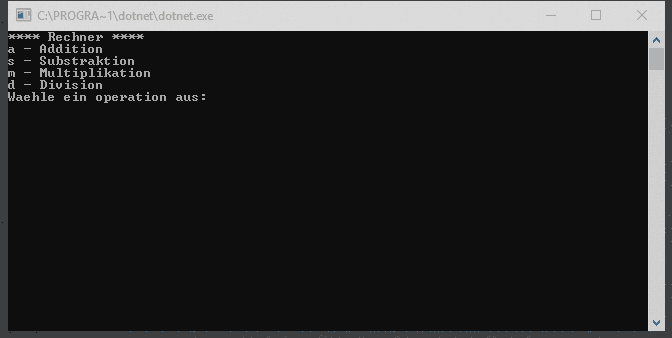

# Bedingte Anweisungen und Verzweigungen

Bedingte Anweisungen können ein Programm auf unterschiedliche Zustände und Eingaben reagieren lassen.

## ```if else```

Durch eine Bediengte Anweisung wird entschieden ob ein bestimmtes Codesegment ausgeführt wird oder nicht. In _C#_ ist diese mit einem ```if``` Befehl realisiert.

```csharp
int zahl = 5;

if(zahl > 0) 
{
    Console.WriteLine("Zahl " + zahl +" ist eine positive Zahl.");
}
```

Eine Verzweigung besteht aus zwei Codeabschnitten: ```if``` und optionalen ```else```.

```csharp
int zahl = -1;

if(zahl > 0) 
{
    Console.WriteLine("Zahl " + zahl +" ist eine positive Zahl.");
}
else
{
    Console.WriteLine("Zahl " + zahl +" ist eine negative Zahl.");
}
 ```
### Aufgabe

In dem letzten Beispiel besteht ein Problem. Was wenn das Zahl ein 0 wird? Denn 0 is weder eine positive noch eine negative Zahl. Bessere das Fehler im folgenden Programm so aus, das bei Zahl 0 eine Nachricht herausgeben wird, dass das Zahl 0 weder negativ noch positiv ist.

```csharp
static void Main(string[] args)
{
    while(true)
    {
        Console.Write("Schreibe eine Zahl: ");
        int zahl = int.Parse(Console.ReadLine());

        if(zahl > 0) 
        {
            Console.WriteLine("Zahl " + zahl +" ist eine positive Zahl.");
        }
        else
        {
            Console.WriteLine("Zahl " + zahl +" ist eine negative Zahl.");
        }

        Console.WriteLine();
    }
}
```
Ein Hinweis: Du kannst das ```else``` auch mit ```if``` kombinieren wie hier unten mit  _Pseudocode_ gezeigt wird.

```csharp
if (Bedienung){}
else if (Bedienung){}
else {}
```

## ```switch case```
```switch case``` ist eine andere Möglichkeit ein Codeablauf zu verändern. Es wird oft als eine alternative zu ```if else``` verwendet werden. Es kann die Codelesbarkeit in manchen Fällen verbessern, vor allem dann wenn eine Variable auf mehrere Bedienungen überprüfen werde sollte.

```csharp
static void Main(string[] args)
{
    Console.Write("Druecke eine Buchstabe am Tastatur. Es sind nur a,b,c oder d erlaubt:  ");
    string buchstabe = Console.ReadLine();
    
    switch(buchstabe) 
    {
        case "a": Console.WriteLine("Du hast 'a' gedrueckt."); break;
        case "b": Console.WriteLine("Du hast 'b' gedrueckt."); break;
        case "c": Console.WriteLine("Du hast 'c' gedrueckt."); break;
        case "d": Console.WriteLine("Du hast 'd' gedrueckt."); break;
        default: Console.WriteLine("Ups du hast eine nicht erlaubte Tast gedrueckt!"); break;
    }
}
```

Der selber code kann man auch mit  ```if else``` schreiben:

```csharp
static void Main(string[] args)
{
    Console.Write("Druecke eine Buchstabe am Tastatur. Es sind nur a,b,c oder d erlaubt:  ");
    string buchstabe = Console.ReadLine();

    if (buchstabe == "a")
    {
        Console.WriteLine("Du hast 'a' gedrueckt.");
    }
    else if (buchstabe == "b")
    {
        Console.WriteLine("Du hast 'b' gedrueckt.");
    }
    else if (buchstabe == "c")
    {
        Console.WriteLine("Du hast 'c' gedrueckt.");
    }
    else if (buchstabe == "d")
    {
        Console.WriteLine("Du hast 'd' gedrueckt.");
    }
    else
    {
        Console.WriteLine("Ups du hast eine nicht erlaubte Tast gedrueckt!");
    }
}
```

Ein ```switch``` besteht aus einen oder mehreren ```case```(s) und einem _nicht_ verpflichtenden ```default``` Bezeichnung. Jeder ```case``` Übeprüft ob eine Bedienung erfüllt ist, falls ja, dann wird das Code in ```case``` ausgeführt und dann das Ablauf mit ```break``` Befehl abgrebrochen, andersfall wird es zum nächstes ```case``` übergehen. Fallst kein ```case``` erfüllt ist, wird das Code im ```default``` ausgeführt.

```csharp

switch(VARIABLE) 
{
    case ÜBERPRÜFUNG: CODE ZU AUSZUFÜHREN; break;
    default: CODE ZU AUSZUFÜHREN; break;
}

```
### Aufgabe
Schreibe ein Rechner mit hilfe von ```switch case```. Der Rechner sollt Addition, Substraktion und Multiplikation und Division können.

Hier kannst du sehen wie das Programm aussehen kann.



Falls du eine Zeichenkette also ```string``` zum Zahl, zum Beispiel ```int``` umwandeln möchtest, muss du das Zahl _parsen_:
```csharp
int einZahl = int.Parse(Console.ReadLine());
```