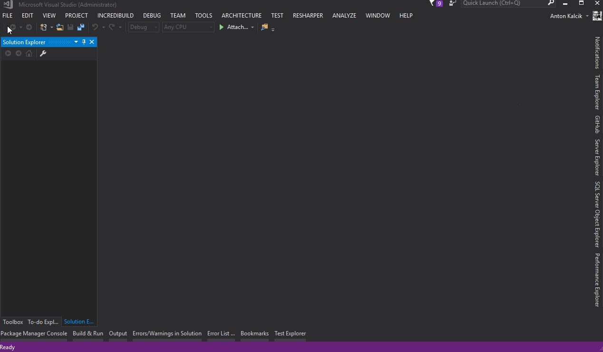
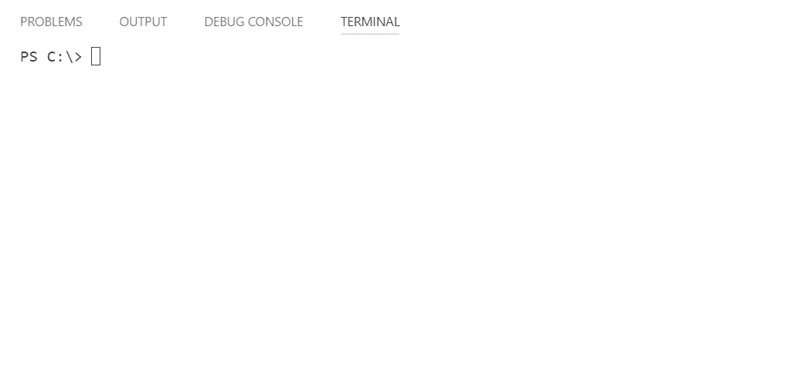
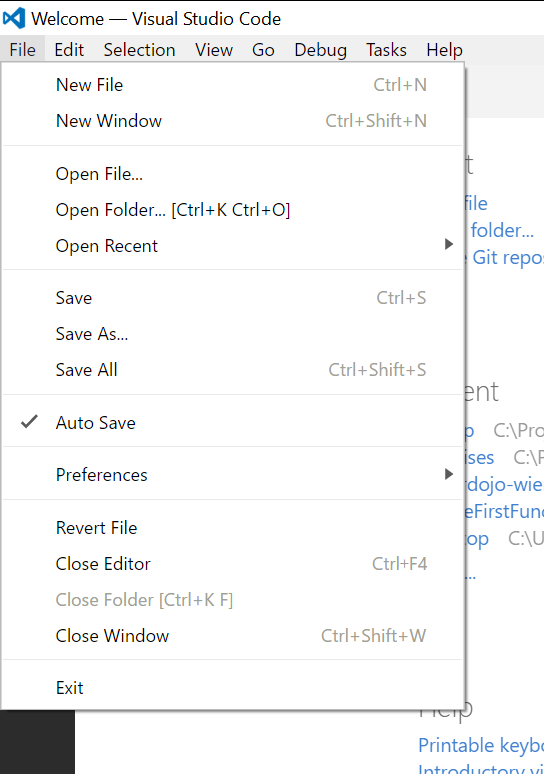
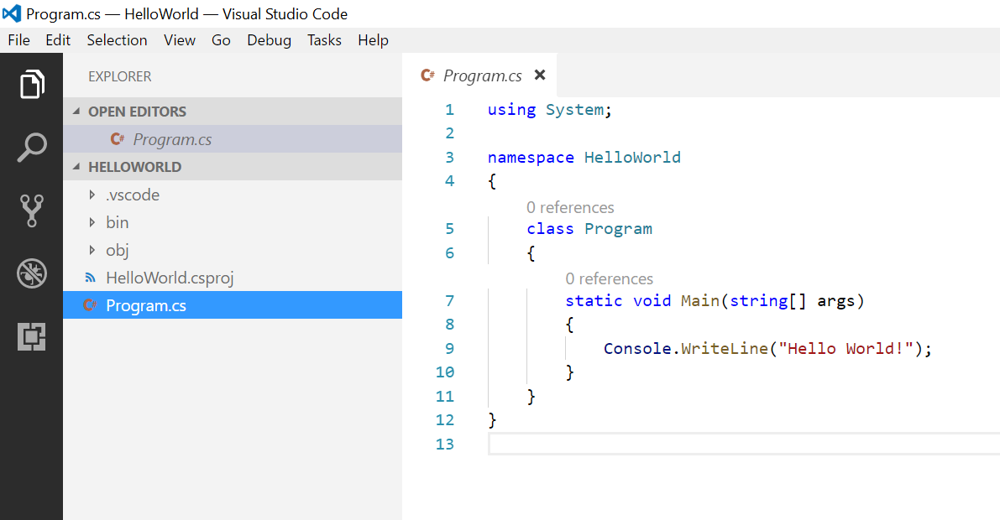

# "Hello World" in Visual Studio

Du wirst nun dein erstes C# Programm entwickeln. Dazu benötigst du eine Entwicklungsumgebung. Wir empfehlen dir Visual Studio Community von Microsoft. Diese ist kostenlos und kann [hier](https://www.visualstudio.com/) heruntergeladen werden.

## Neue Solution
Programme in C# werden üblicherweise in sogenannten Solutions organisiert. Jede Solution kann ein oder mehrere Projekte enthalten. Lege eine Solution _"HelloWorld"_ an. Siehe dazu das Video unten.



Nach dem die Solution erzeugt geworden ist solltest du folgende Struktur in Solution Explorer sehen:


Nun schreibst du dein erstes eigenes Programm in C#. Es geht darum das Program in [```Program.cs```](src/HelloWorld/HelloWorld/Program.cs) so zu erweitern, dass nach dem Start
"Hello World!" in der Konsole erscheint.

```csharp
using System;
using System.Collections.Generic;
using System.Linq;
using System.Text;
using System.Threading.Tasks;

namespace HelloWorld
{
    class Program
    {
        static void Main(string[] args)
        {
        }
    }
}
```
In C# gibt es eine Methode ```Console.WriteLine``` mit der man einen beliebigen Text auf dem Bildschirm ausgeben kann. Das untere Beispiel gibt den Text _"Hello World!"_ aus.

```csharp 
Console.WriteLine("Hello World!")
```
Jetzt das komplette Program:

```csharp
using System;
using System.Collections.Generic;
using System.Linq;
using System.Text;
using System.Threading.Tasks;

namespace HelloWorld
{
    class Program
    {
        static void Main(string[] args)
        {
            Console.WriteLine("Hello World!")
        }
    }
}
```

Jetzt kannst du das Programm ganz einfach mit der Taste F5 starten. Du wirst jedoch sehen, dass das Programm zwar startet aber ziemlich schnell wieder beendet wird. Mann muss also noch eine Pause einbauen. Mit der Methode ```Console.ReadKey()``` wird dein Programm auf eine beliebige Eingabe warten. Überlegt dir, wo du diesen Methodenaufruf am besten einbaust.

# "Hello World" in Visual Studio Code
Als alternative zu Visual Studio kannst auch [Visual Studio Code][visual_studio_code_link] verwenden. Visual Studio Code ist ein Plattformübergreifendes Editor zur Entwicklung von Consolen-, Web- und Cloud-Anwendungen und bietet unter anderem Funktionen wie Syntax-Highlighting für mehr als 20 Programmiersprachen.

## Installation von Tools
1) Als erstes muss du dir ein [.NET Core Framework](https://www.microsoft.com/net/core) installieren.
2) Installiere dir nun [Visual Studio Code][visual_studio_code_link].
3) Installiere dir [C# extension](https://marketplace.visualstudio.com/items?itemName=ms-vscode.csharp) von VS Code Marketplace.

[visual_studio_code_link]: https://code.visualstudio.com

## Program erstellen
Als erstes muss du ein dir ein Verzeichniss auswählen wo du dein Program erstellen möchtest. Öffne dazu ein _Terminal_ in Visual Studio Code. Dazu gehst du auf Menü _View_ und wählst _Integrated Terminal_ aus.


In den Terminal tipps du dann folgendes Befehl: ```cd [Pfad]``` wo Pfad das tatsächliche Pfad zum deinem Verzeichniss ist. Wir nehmen an du möchtest das auf deinem Desktop erstellen, also wird das Befehl ```cd c:\Users\[Benutzername]\Desktop``` lauten, wo Benutzername dein Windows Benutzername ist.



Jetzt können wir ein neues Program anlegen. Das machst du mit dem Befehlt ```dotnet new console -n HelloWorld```. Jetzt wird ein neues Verzeichnis angelegt und du öffnest nun dieses Verzeichniss mit dem Visual Studio Code. Dazu gehst du auf _File_ und _Open Folder_.



Wenn du auf das _Program.cs_ clicks, öffnet sich nun das Program. Es wird wahrscheinlich ein Dialog mit _Required assets to Build and Debug are missing from 'HelloWorld'. Add them?_ erscheinen. Beantworte es mit _Yes_.



Jetzt kannst du das Programm mit _F5_ starten. Möglicherweise erscheint wieder ein Dialog mit _Environment Settings_. Wähle dazu _.NET Core_ aus.

