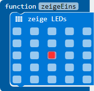

# Spielwürfel

In dieser Übung entwickeln wir einen Spielwürfel mit dem micro:bit.

## Funktionen für verschiedene Würfelzustände

Zuerst bauen wir für jeden Würfelzustand eine Funktion. Ein Würfelzustand ist eine gültige Kombination von Augen die nach einem Wurf angezeigt wird.

Eine Funktion erzeugst du in dem du im Menü _Fortgeschritten_ den Punkt  _Functions_ auswählst und dann _Make a Function_ klickst. Gib der Funktion den Namen _zeigeEins_.


Die Funktion ```function zeigeEins``` soll ein Zahl _eins_ am Display deines micro:bit anzeigen. Wähle dazu im Menü _Grundlagen_ den Baustein ```zeige LEDs``` aus und verschiebe diesen in die vorher erzeugte Funktion ```function zeigeEins```. Markiere außerdem noch die Diode in der Mitte, also jene die du bei einer gewürfelten Eins aufleuchten lassen willst..



Nach dem gleichen Prinzip gehst du auch für die anderen Würfelzustände vor.


## Würfeln

Der micro:bit kann mit seinem Beschleunigungssensor auf ein Schütteln reagieren. Dazu wählst du im Menü _Eingabe_ den Block ```wenn geschüttelt``` aus. Dieser Block wird immer dann aufgerufen wenn du deinen micro:bit schüttelst.


Nun benötigst du noch eine sogenannte Zufallszahl. Das kannst ...