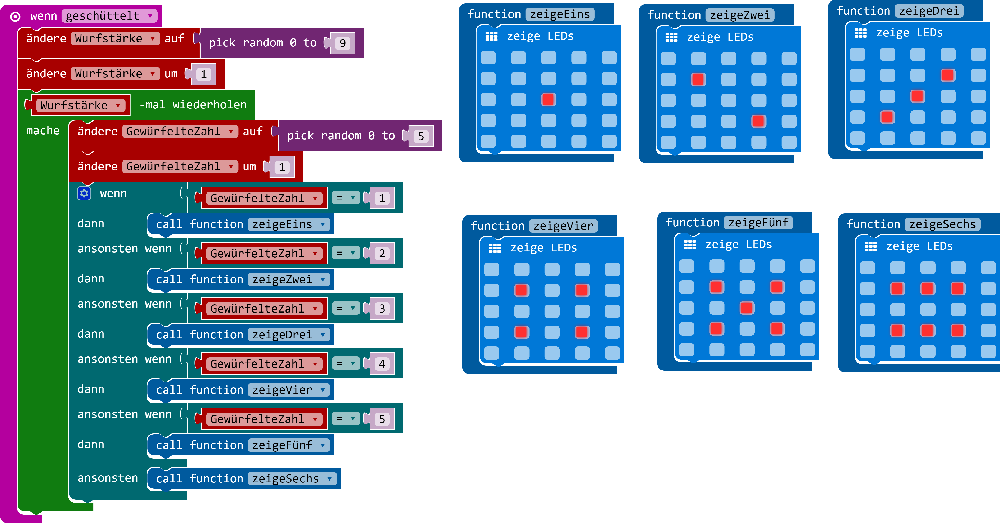

# Spielwürfel

In dieser Übung wirst du auf deinem micro:bit einen Spielwürfel entwickeln.

## Funktionen für verschiedene Würfelzustände

Für jeden Würfelzustand benötigst du eine Funktion. Mit Würfelzustand ist das gemeint, was nach jedem Wurf angezeigt wird.

Um eine Funktion zu erzeugen wähle im Menü _Fortgeschritten_ zuerst _Functions_ und schließlich _Make a Function_ aus. Benenne die Funktion mit _zeigeEins_.


Die Funktion ```function zeigeEins``` soll die Zahl _eins_ am Display deines micro:bit anzeigen. Dazu wähle in _Grundlagen_ den Baustein ```zeige LEDs``` aus und verschiebe diesen in die ```function zeigeEins```. In dem Beaustein markierst du dann die LED in der Mitte welche aufleuchten soll wenn die Eins anzeigt wird.


Lege nun auch für alle anderen Würfelzustände, also zwei bis sechs, jeweils eine Funktion nach obigen Muster an.


## Würfeln

Der micro:bit kann mit seinem Beschleunigungssensor auf schütteln reagieren. Um dieses zu ermöglichen wähle von _Eingabe_ den Block ```wenn geschüttelt``` aus. Dieser Block wird immer dann aufgerufen, wenn der micro:bit geschüttelt wird.


Als nächstes muss du eine zufällige Zahl erzeugen. Dazu kannst du die Funktion ```pick random``` verwenden. Um den Baustein verwenden zu können, benötigst du noch eine Variable, in welcher die Zufallszahl gespeichert wird. Um die Variable zu erzeugen gehe zu _Variablen_ und verschiebe der Baustein ```ändere Platzhalter auf 0``` ins Baustein ```wenn geschüttelt```. Dann verwendest du aus  _Mathematik_ den bereits erwähnten ```pick random``` Baustein.


Die Variable ```Platzhalter``` hat jetzt allerdings einen nicht sehr sprechenden Namen. Entwickler vergeben gerne sprechende Namen um die Programme besser lesen zu können. Bennen also die Variable noch um. Das kannst du machen in dem du auf das kleines Dreieck neben der Variablen ```Platzhalter``` klickst und _Rename variable..._ wählst. So kannst du die Variable zum Beispiel ```GewürfelteZahl``` nennen.


Vielleicht ist dir aufgefallen, dass das Intervall aus welchem die Zufallszahl gewählt wird zwischen 0 und bei 5 liegt. Aun den ersten Blick wirkt dies etwas merkwürdig. Aber wir können nun sechs mögliche Zahlen würfeln und wenn man bei _Null_ anfängt, dann ist die höchste Zahl eben _Fünf_. Um das Programm verständlicher und lesbar zu gestalten kannst du Variable ```GewürfelteZahl``` um eins erhöhen und so ein Intervall von _Eins_ bis _Sechs_ erhalten.


## Zeige gewürfelte Zahl an

Das wird jetzt einfach. Um das gewürfelte Zahl anzuzeigen gehst du in _Logik_ und nimmst du der Baustein ```_wenn_dann_ansonsten```. Mit diesen Baustein hast du die Möglichkeit folgende Logik aufzubauen: Wenn das ```GewürfelteZahl``` eins ist, dann rufst du die Funktion ```zeigeEins```, für zwei dann die Funktion ```zeigeZwei``` usw. Jedoch es zu ermöglichen muss du das Baustein ```_wenn_dann_ansonsten``` ein bisschen modifizieren. 

Hol dir das Baustein ```_wenn_dann_ansonsten``` und klicke auf das kleine rädchen um diese Baustein zu verändern.


Jetzt wird das ```GewürfelteZahl``` mit einem erwarteten Zahl verglichen. Dazu holt man sich von _Logik_ das ```ist gleich``` Baustein. Auf die linke Seite setzt man die Variable ```GewürfelteZahl```ein auf die rechte das erwartete Wert. Diese setze man in den ```wenn_dann_ansonsten``` Baustein ein.
Von ```dann``` ruft man dann die jewalige Funktion mit ```call function``` von Menu _Functions_.


Wenn du jetzt auf das _Shake_ button in micro:bit Simulator clickst, solltest du jedensmal ein Wurfergebniss sehen.

## Aufgabe
Um es ein bisschen spannender zu machen, versuche das Programm so erweitern dass man während würfeln verschiedene Zahlen sehen kann. Genau als wenn eine Würfel auf dem Tisch rollt.


<a href="https://makecode.microbit.org/_UWyCsv6xEd8W" target="_blank" rel="some text"></a>